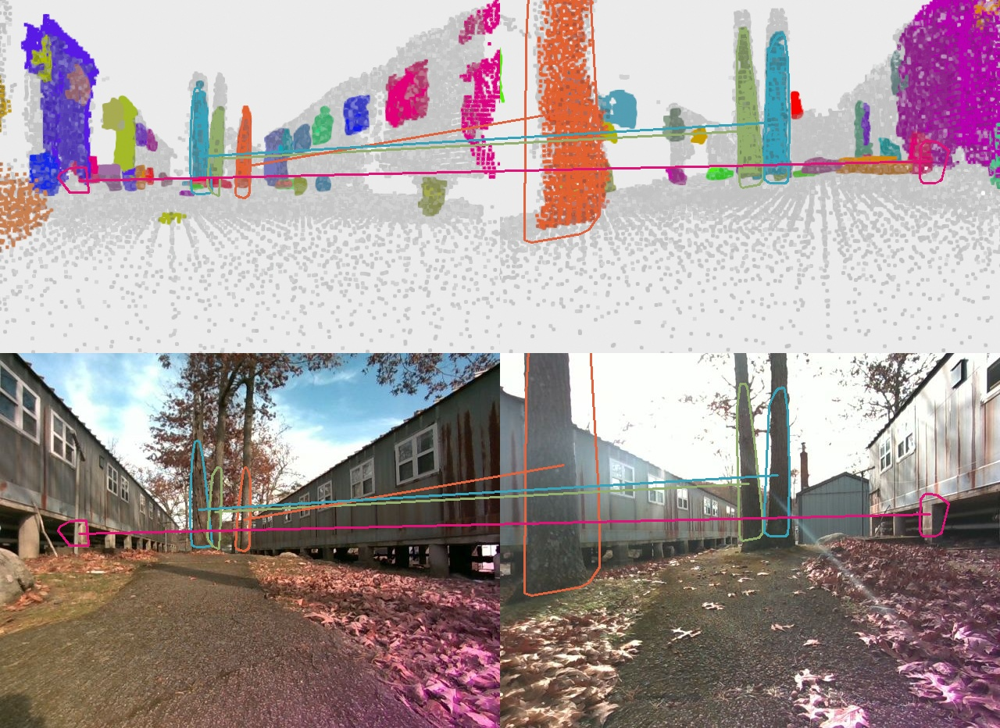
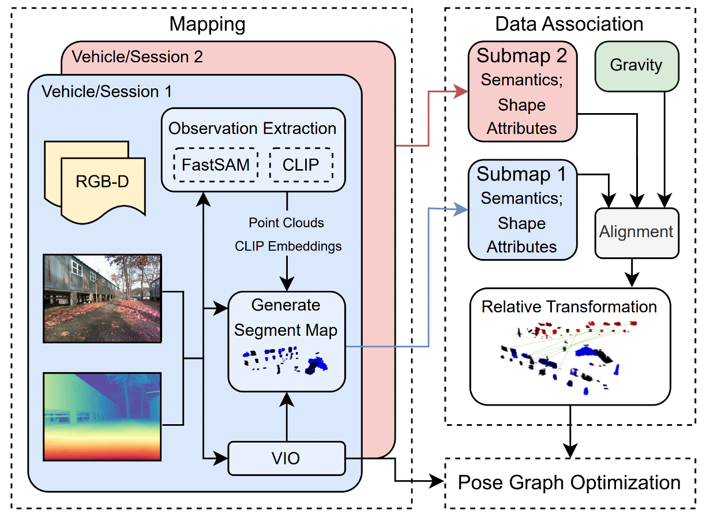

# ROMAN



Welcome to ROMAN(<ins>R</ins>obust <ins>O</ins>bject <ins>M</ins>ap <ins>A</ins>lignment A<ins>n</ins>ywhere).
ROMAN is a view-invariant global localization method that maps open-set objects and uses the geometry, shape, and semantics of objects to find the transformation between a current pose and previously created object map.
This enables loop closure between robots even when a scene is observed from *opposite views.*

Included in this repository is code for open-set object mapping and object map registration using our robust data association algorithm.

## Citation

If you find ROMAN useful in your work, please cite our paper:

M.B. Peterson, Y.X. Jia, Y. Tian and J.P. How, "ROMAN: Open-Set Object Map Alignment for Robust View-Invariant Global Localization,"
*arXiv preprint arXiv:2410.08262*, 2024.

```
@article{peterson2024roman,
  title={ROMAN: Open-Set Object Map Alignment for Robust View-Invariant Global Localization},
  author={Peterson, Mason B and Jia, Yi Xuan and Tian, Yulun and Thomas, Annika and How, Jonathan P},
  journal={arXiv preprint arXiv:2410.08262},
  year={2024}
}
```

## System Overview




## Install

First, **activate any virtual environment you would like to use with ROMAN**.

Then, clone and install with:

```
git clone git@github.com:mit-acl/roman.git
./roman/install.sh
```

While mapping and loop closure can be performed standalone, we use Kimera-RPGO for pose graph optimization. 
We are working to make that publicly runnable in the future.

## Demo

1. Download a small portion of the [Kimera Multi Data](https://github.com/MIT-SPARK/Kimera-Multi-Data) that is used for the ROMAN SLAM demo. The data subset is available for download [here](https://drive.google.com/drive/folders/1ANdi4IyroWzJmd85ap1V-IMF8-I9haUB?usp=sharing).
2. In your `.bashrc` or in the terminal where you will run the ROMAN demo export the following environment variable: 

```
export ROMAN_DEMO_DATA=<path to the demo>
```

3. `cd` into this repo and run the following to start the demo

```
mkdir demo_output
python3 demo/demo.py \
    -r sparkal1 sparkal2 \
    -p demo/params/demo -e ROBOT \
    -o demo_output
```

Optionally, the mapping process can be visualized with the `-m` argument to show the map projected on the camera image as it is created or `-3` command to show a 3D visualization of the map.
However, these will cause the demo to run slower. 

---

This research is supported by Ford Motor Company, DSTA, ONR, and
ARL DCIST under Cooperative Agreement Number W911NF-17-2-0181.

